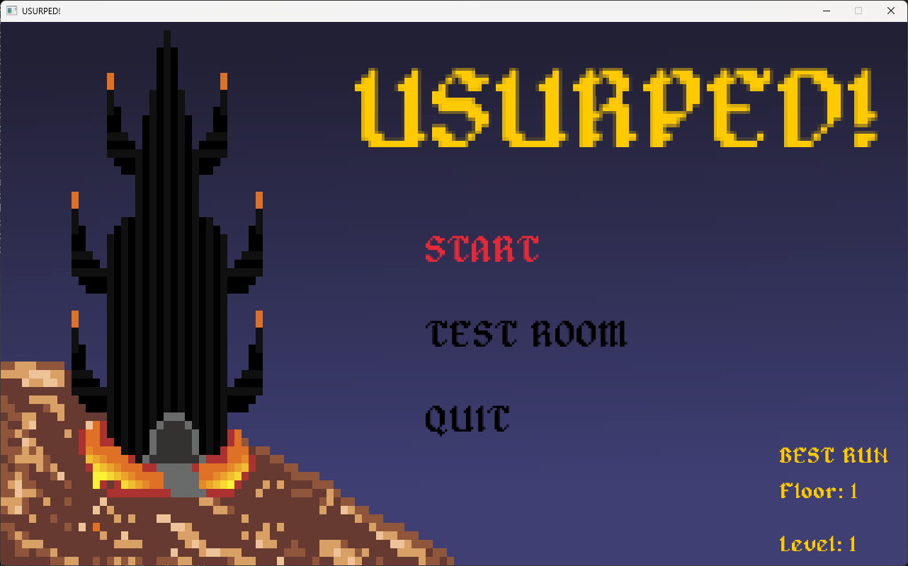
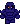

# USURPED! Engine

---

## Created using C++ and Raylib, with level creation done in Tiled.

+ ### This project was created/started as part of my final project for the Game Engine Development course at WIT. 

+ ### All assets and code are included in this repository. As of September 2026, this is a preview of what the engine is capable of, demonstrated through a complete demo for a game.

+ ### I do intend to expand on USURPED! in the future with a variety of new features.

---

## Stack and External Sources/Credit

---

> ### [Raylib](https://www.raylib.com/)
> **Raylib was used for all rendering and sound components of the engine. Most other features outside of rendering and sound went unused.**

 

> ### [JSON for Modern C++](https://github.com/nlohmann/json)
> **The json single include from Niels Lohmann. Extremely important for loading enemy data, item data, and level data.**

 

> ### [Bxfr](https://www.bfxr.net/)
> **Used for the game sound design. Very intuitive and fun to use.**

 

> ### [Tiled](https://www.mapeditor.org/)
> **Used to create and export levels as usable json files to the engine.**

 

> ### [Tileson](https://github.com/SSBMTonberry/tileson)
> **Another extremely useful single include that streamlined the process of loading Tiled maps. Used in conjunction with the json single include.**

 

> ### [Aseprite](https://www.aseprite.org/)
> **The primary asset creation software used for USURPED!. All assets were created by myself in Aseprite.**

 

> ### [ImGui](https://github.com/ocornut/imgui)
> **Used for the "Test Room", allowing for UI-based debugging and messing around with different systems.

 

> ### [Alagard Font](https://www.dafont.com/alagard.font)
> **The primary font used for the game itself. Credits to Hewett Tsoi, 2013.**

---

## Engine Features

---

+ <ins>**Almost full ECS**:</ins> With a few exceptions. Every moving part of this engine is an "entity" in the entity component system.
 

+ <ins>**Full 2D AABB collision**:</ins> Implemented with custom logic outside of Raylib's default implementation.
 

+ <ins>**"Room" camera system**:</ins> Determines player position based on a room grid and positions the camera accordingly.
 

+ <ins>**Complete asset loading system**:</ins> For textures, sounds/music and JSON. All assets can be specified in a .txt file, along with any specifics such as size/scale, animation frames, etc.
 

+ <ins>**Dynamic Entity Management**:</ins> Entities are dynamically created and removed while avoiding iterator invalidation.
 

+ <ins>**Scene system**:</ins> A system that allows for easily swapping to and from "scenes", each with their own unique registered input, process flows, physics and more.
 

+ <ins>**"Action" system**:</ins> An action system that processes user inputs; registering new inputs to a scene is trivial with this system.
 

+ <ins>**Dynamic rendering**:</ins> Only textures visible by the engine camera are rendered at runtime, saving heavily on memory usage.

---

## The Game

---

### USURPED! is a roguelike dungeon-crawler, inspired by early JRPG games such as Dragon Quest and Final Fantasy.

---

### You have been Usurped! Reclaim your dark fortress from the heroes who defeated you.

### Take the reigns as the dungeon boss and battle your way back to your throne. Collect weapons, magic and items along the way to help in your ambitions.

---

## How To Play

---

> <kbd>Space</kbd> - Select/interact
>  
> <kbd>Tab</kbd> - Open menu
>  
> <kbd>Backspace</kbd> - Back
>  
> <kbd>W</kbd> <kbd>A</kbd> <kbd>S</kbd> <kbd>D</kbd> - Up/Left/Down/Right
>  
> <kbd>C</kbd> - Change camera view (room/follow)

> + Select "Start" to begin a new run.
> + Select "Test Room" to go into the debug room and test out various engine features.
> + Select "Quit" to close out of the application.

Once you have started a run, your goal is to reach the highest floor you can. Collect loot from chests and battle enemies to become more powerful. Enemies will get increasingly difficult with each floor, so be ready!
If your HP drops to 0, the run ends and your progress is reset. Your best run is saved, and can be viewed from the title screen.

---

